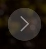

# SteakOverflow - The Coding Steakhouse

[View the live project here.](https://steakoverflow-6062ce4ca62e.herokuapp.com/)

Welcome to SteakOverflow – Where Culinary Excellence Meets Code Mastery! Step into the world of gastronomic innovation, where sizzling steaks and cutting-edge coding unite to create an extraordinary dining experience. At SteakOverflow, we've crafted a one-of-a-kind restaurant that celebrates the art of cooking and the brilliance of programming.

Our attentive staff is here to ensure your dining experience is nothing short of exceptional. Whether you need a recommendation from our menu or a quick tech-related chat, feel free to ask—we're more than happy to assist.

Thank you for joining us at SteakOverflow, where extraordinary steaks meet the extraordinary world of coding. May your taste buds be delighted, and may your coding dreams reach new heights with each visit. Enjoy your meal, and happy coding!

---

# User Experience (UX)

This website is designed to give users and future customers the ability to view the menu for all it offers, along with reading up on the coding challenge. It gives the user the ability to set up an account and create a booking which can be amended/deleted. It is then approved by an admin/member of staff.  

## Intended Audience

* **Coding Community**: People involved in coding communities, forums or online groups who seek novel experiences related to their interest.
* **Foodies**: Gourmet food enthusiasts who are curious to try new and inventive culinary offerings.
* **Tech Company Teams and Events**: Corporate teams, tech companies, or coding meetups looking for a distinctive venue to host events or team outings.
* **Families and Friends**: People looking for a unique and entertaining dining experience to share with their loved ones.
* **Tourists and Travelers**: Visitors to the area who want to explore local restaurants with a distinctive theme.
* **Social Media Influencers and Bloggers**: Content creators interested in sharing their experiences at a coding-themed steakhouse with their followers.

 

# Design

## Wireframes & Bootstrap Templates

I used [BootstrapMade](https://bootstrapmade.com/) to locate a suitable template to fit my vision for the SteakOverflow website, then mocked up my idea on a Wireframe Design

Wireframes were created for the site with [Wireframe.cc](https://wireframe.cc/)

 

## Colour Scheme 

Colour palette was created using: 

* [Colormind](http://colormind.io/)

For the navbar bar `rgba(0, 0, 0, 0.75)` was used for some transparency. Along with `#6fc02c` for any button hover. 

 

## Typography

Open Sans, Roboto and Poppins were chosen from [Google Fonts](https://fonts.google.com/).

 

## Imagery

Images are located only on the page. Under the navigation as the header/hero image, and also in the challenge section. 

Images were took from two stock photo websites: 

* [Pexels](https://www.pexels.com/)
* [Unsplash](https://unsplash.com/)

Icons were used throught the website, for buttons, menu layout, challenge section, contact seciont and for social links on the footer of the website. The icons used on the site were taken from: 

* [Font Awesome](https://fontawesome.com/)
* [Bootstrap](https://icons.getbootstrap.com/)

 

# Features

## Navigation

* Featured at the top of the page and consistent throughout the website. Stays in place as scrolling. 
* The nagivagtion shows the restaurant name in the left corner that links back to the home page.
* The other navigation links are located to the right: Home Menu, Challenge and Conact Us which links to the relavant section on the home page. Along with login/logout and bookings that take you to their corresponding pages.
* The navbar is coded to identify if the user is logged in or not, and will subsequently show the correct options available.
* The navigation bar is responsive across all media devices. With a drop down available for selections on mobile devices
* An underline is displayed when hovering across the link the user wants to choose.

  
*Screenshot of navigation bar on desktop before logging in*

  
*Screenshot of navigation bar on desktop after logging in*

  
*Screenshot of navigation bar on mobile*

## Hero Section

* This section contains a carousel of 3 images, that change on sequence.
* Each section with different corresponding text, and a 'Read More' button to direct the user to the relevant section. 
* There is a button located either side of the hero image with a left and right chevron arrow. 
* There is also a indicator at the bottom of the hero section to indicate what slide the user is currently viewing. 

  
*Screenshot of the hero section*

   
*Screenshot of the read more button while static and also hovered on the hero section*

   
*Screenshot of both left and right cheveron arrows on the hero section*

  
*Screenshot of the slide indicator on the hero section*

## Menu Section

* This section is split into 3 columns and 2 rows showing what is on offer at the restaurant.
* Each section contains its own title with a [Font Awesome](https://fontawesome.com/) icon above it. Below is the dishes for said section. 
* The starters and mains share the same icon, while dessert and beverages having unique icons. When hovered over the menu section, there is slight show behind each icon. 

 

  
*Screenshot of the menu section*

   
*Screenshot of the title and icons from the menu section*

   
*Screenshot of the icons in different states from the menu section*

## Challenge Section

* This section explains the coding challenge that customers can attempt at the restaurant. 
* There is a static image to the left, while information on the coding challenge provided to the right of the image. 
* [Font Awesome](https://fontawesome.com/) icons were used once again to break up the text. 

 

  
*Screenshot of the challenge section*

## Contact Section

* The contact us section is split into three columns, stating location, opening hours, email and number for the restaurant. 
* [Bootstrap](https://icons.getbootstrap.com/) icons were used above the title of each section.

 

  
*Screenshot of the contact section*

## Footer Section

* The footer of the website is designed to be minimalistic and include a number of links to the different social networks attached to SteakOverflow.
* These are displayed using icons obtained through [Font Awesome](https://fontawesome.com/).
* These icons are clickable and will open up the respective social networks in a new page.

  
*Screenshot of the footer section*

## Back to top button

* A back to top button appears after the user scrolls past the Hero Section, in the bottom right of the website.
* Like other buttons on the page, when the user highlights over it, it changes colour as shown below.  

 

   
*Screenshot of the back to top button in different states *

## User Login / Register / Logout

* As mentioned above, in the navbar, the user is able to login to a previously made account, or register a new account with SteakOverflow
* The user must do this so as to create a booking with the restaurant. 

 

  
*Screenshot of the sign in page*

  
*Screenshot of the sign up page*

 

* Once the user is logged in, the have the option of signing out, by clicking the 'logout' button in the navbar. Which will bring them to the sign out page. 

 

  
*Screenshot of the sign out page*