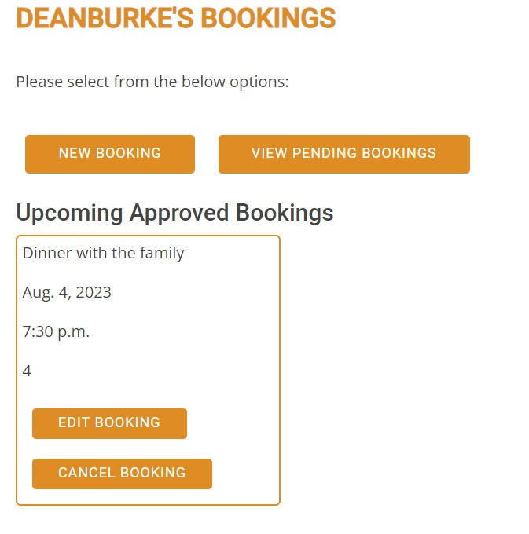
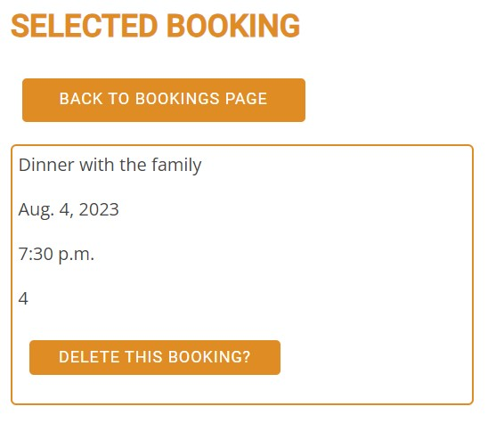

# SteakOverflow - The Coding Steakhouse

[View the live project here.](https://steakoverflow-6062ce4ca62e.herokuapp.com/)

Welcome to SteakOverflow – Where Culinary Excellence Meets Code Mastery! Step into the world of gastronomic innovation, where sizzling steaks and cutting-edge coding unite to create an extraordinary dining experience. At SteakOverflow, we've crafted a one-of-a-kind restaurant that celebrates the art of cooking and the brilliance of programming.

Our attentive staff is here to ensure your dining experience is nothing short of exceptional. Whether you need a recommendation from our menu or a quick tech-related chat, feel free to ask—we're more than happy to assist.

Thank you for joining us at SteakOverflow, where extraordinary steaks meet the extraordinary world of coding. May your taste buds be delighted, and may your coding dreams reach new heights with each visit. Enjoy your meal, and happy coding!

---

# User Experience (UX)

This website is designed to give users and future customers the ability to view the menu for all it offers, along with reading up on the coding challenge. It gives the user the ability to set up an account and create a booking which can be amended/deleted. It is then approved by an admin/member of staff.  

## Intended Audience

* **Coding Community**: People involved in coding communities, forums or online groups who seek novel experiences related to their interest.
* **Foodies**: Gourmet food enthusiasts who are curious to try new and inventive culinary offerings.
* **Tech Company Teams and Events**: Corporate teams, tech companies, or coding meetups looking for a distinctive venue to host events or team outings.
* **Families and Friends**: People looking for a unique and entertaining dining experience to share with their loved ones.
* **Tourists and Travelers**: Visitors to the area who want to explore local restaurants with a distinctive theme.
* **Social Media Influencers and Bloggers**: Content creators interested in sharing their experiences at a coding-themed steakhouse with their followers.

 

# Design

## Wireframes & Bootstrap Templates

I used [BootstrapMade](https://bootstrapmade.com/) to locate a suitable template to fit my vision for the SteakOverflow website, then mocked up my idea on a Wireframe Design

Wireframes were created for the site with [Wireframe.cc](https://wireframe.cc/)

 

## Colour Scheme 

Colour palette was created using: 

* [Colormind](http://colormind.io/)

For the navbar bar `rgba(0, 0, 0, 0.75)` was used for some transparency. Along with `#6fc02c` for any button hover. 

 

## Typography

Open Sans, Roboto and Poppins were chosen from [Google Fonts](https://fonts.google.com/).

 

## Imagery

Images are located only on the page. Under the navigation as the header/hero image, and also in the challenge section. 

Images were took from two stock photo websites: 

* [Pexels](https://www.pexels.com/)
* [Unsplash](https://unsplash.com/)

Icons were used throught the website, for buttons, menu layout, challenge section, contact seciont and for social links on the footer of the website. The icons used on the site were taken from: 

* [Font Awesome](https://fontawesome.com/)
* [Bootstrap](https://icons.getbootstrap.com/)

 

# Features

## Navigation

* Featured at the top of the page and consistent throughout the website. Stays in place as scrolling. 
* The nagivagtion shows the restaurant name in the left corner that links back to the home page.
* The other navigation links are located to the right: Home Menu, Challenge and Conact Us which links to the relavant section on the home page. Along with login/logout and bookings that take you to their corresponding pages.
* The navbar is coded to identify if the user is logged in or not, and will subsequently show the correct options available.
* The navigation bar is responsive across all media devices. With a drop down available for selections on mobile devices
* An underline is displayed when hovering across the link the user wants to choose.

  
*Screenshot of navigation bar on desktop before logging in*

  
*Screenshot of navigation bar on desktop after logging in*

  
*Screenshot of navigation bar on mobile*

## Hero Section

* This section contains a carousel of 3 images, that change on sequence.
* Each section with different corresponding text, and a 'Read More' button to direct the user to the relevant section. 
* There is a button located either side of the hero image with a left and right chevron arrow. 
* There is also a indicator at the bottom of the hero section to indicate what slide the user is currently viewing. 

  
*Screenshot of the hero section*

   
*Screenshot of the read more button while static and also hovered on the hero section*

   
*Screenshot of both left and right cheveron arrows on the hero section*

  
*Screenshot of the slide indicator on the hero section*

## Menu Section

* This section is split into 3 columns and 2 rows showing what is on offer at the restaurant.
* Each section contains its own title with a [Font Awesome](https://fontawesome.com/) icon above it. Below is the dishes for said section. 
* The starters and mains share the same icon, while dessert and beverages having unique icons. When hovered over the menu section, there is slight show behind each icon. 

 

  
*Screenshot of the menu section*

   
*Screenshot of the title and icons from the menu section*

   
*Screenshot of the icons in different states from the menu section*

## Challenge Section

* This section explains the coding challenge that customers can attempt at the restaurant. 
* There is a static image to the left, while information on the coding challenge provided to the right of the image. 
* [Font Awesome](https://fontawesome.com/) icons were used once again to break up the text. 

 

  
*Screenshot of the challenge section*

## Contact Section

* The contact us section is split into three columns, stating location, opening hours, email and number for the restaurant. 
* [Bootstrap](https://icons.getbootstrap.com/) icons were used above the title of each section.

 

  
*Screenshot of the contact section*

## Footer Section

* The footer of the website is designed to be minimalistic and include a number of links to the different social networks attached to SteakOverflow.
* These are displayed using icons obtained through [Font Awesome](https://fontawesome.com/).
* These icons are clickable and will open up the respective social networks in a new page.

  
*Screenshot of the footer section*

## Back to top button

* A back to top button appears after the user scrolls past the Hero Section, in the bottom right of the website.
* Like other buttons on the page, when the user highlights over it, it changes colour as shown below.  

 

   
*Screenshot of the back to top button in different states *

## User Login / Register / Logout

* As mentioned above, in the navbar, the user is able to login to a previously made account, or register a new account with SteakOverflow
* The user must do this so as to create a booking with the restaurant. 

 

  
*Screenshot of the sign in page*

  
*Screenshot of the sign up page*

 

* There are password protocols in place, to catch any incorrect information submitted when signing in or registering a new account.

  
*Screenshot of user invalid password*

  
*Screenshot of user incorrect password*

  
*Screenshot of username or password incorrect*

 

* Once the user is logged in, the have the option of signing out, by clicking the 'logout' button in the navbar. Which will bring them to the sign out page. 

 

  
*Screenshot of the sign out page*

## Bookings / Admin Portal

* The user has the option of clicking on the 'BOOKINGS' navbar button or one of it's choices from the dropdown, 'Make a booking' or 'View pending bookings'.
* This will bring the user to the relevant pages.
* The user will be automatically prompted to login if they aren't already before preceding to each individual page. 

 

  
*Screenshot of navbar options for bookings*

 

* On the bookings page, the user will be greeted with the option to make a new booking, view pending bookings(awaiting admin approval) and viw already approved bookings. 

 

  
*Screenshot of the bookings page*

 

* If the user wants to create a new booking. They will be brought to the new bookings page, where there is information that is required to be filled out to complete their booking.

 

  
*Screenshot of the new bookings page*

 

* Once the user has submitted their booking they can view it, on the pending bookings page.

 

  
*Screenshot of the pending bookings page*

 

* An admin to the website, manager / supervisor, will have to ability to login to the admin portal, using a "/admin" at the end of the domain. Where they will be prompted with a Username & Password login.

 

  
*Screenshot of the admin portal*

 

* Once logged in, the admin can create, view, edit and delete users. 
* Along with approving bookings made by users or add bookings themselves if they've received any from emails or phone calls to the restaurant. 
* The view can be set to descending date order to organize upcoming pending bookings, which they can judge if they have the space or not. 
* There are filter and search functionality withing the bookings page on the admin portal.
* The admin can revert bookings back to pending or delete altogether. 

 

  
*Screenshot of the bookings page on the admin portal*

 

* Once the booking is approved by the admin, it will automatically appear in the user's 'Upcoming Approved Bookings'.

 

  
*Screenshot of the approved bookings*

 

* The user has the option to edit approved and pending bookings. 
* Depending on the status of the booking, the back button will show either back to pending bookings, or back to the bookings page. 
* Once the user clicks edit booking, it will load the info on the selected booking into the fields.
* Once you update an approved booking, it will move back to a pending status, awaiting admin approval. 

 

  
*Screenshot of edit bookings*

 

* If the user wants to delete a booking, they can click the cancel booking button located under each individual booking. 
* It will bring them to a new page, and prompt the user to confirm if they want to delete the selected booking.

 

  
*Screenshot of delete bookings*

 

## Future Features

There are number of feature that I want to add in the future to this project. 

* Manager / Supervisor page, where they can log in as admin, and remain on the website. It will have a list of all bookings, one page for pending, one for approved. It will be set up in a calendar format, where the staff member can click on a day, and it will bring up the bookings in order of the time selected. 
* Set the max capacity for the restaurant, so once it reached for a given period (calculated by booking time + 2 hours). Any new bookings will prompt the user about the unavailability
* Set the opening hours of the restaurant within the available time to select from when booking. 
* Set up a social account login, where users can sign in via a social account.
* Contact form, for any users to send in queries about bookings, menu or just in general. Which will send an email to staff using EmailJS.
* Set a requirement to have an email address, on each user account. So to have the ability of setting up a push notification alert to the user once the status has changed of their booking. 

 

# Testing

There was a number of different tests done to ensure that website was working as it should:

* The website was tested on a number of different browsers:
    * Windows
        * Firefox on Windows 10 Pro
        * Chrome on Windows 10 Pro
    * Android
        * Chrome OnePlus 10
        * Chrome Samsung Galaxy S22
    * Apple iOS
        * Safari iPhone SE
* Responsiveness was tested for all pages. 

## Manual Testing

* Navbar:
    * Tested to make sure it recognized on whether a user was logged in or not, resulting in showing the applicable button(s) to select from.

 

* User Login/Sign In/Logout:
    * Tested to make sure when signing up, a user name was needed, which couldn't be a username that has been previously made. New passwords created, had to match, wouldn't let the user proceed if this failed. 
    * When signing in, the username and password had to match, a prompt would be shown if this failed.
    * Tested to make sure when signing up, logging in or logging out, the user is then diverted back to the home page. 

 

* Bookings:
    * Tested to make sure the username of the the logged in user was displayed at the top of the bookings page.
    * Tested to make sure all fields must be filled out by the user, or admin(via portal), to create a booking, or the form wouldn't be allowed to be submitted.
    * Tested to make sure all of the user's bookings were visible, whether that be pending or approved. And they would all be displayed in the correct format and styling once the for loop is complete. 
    * Tested to make sure once a pending booking is approved by an admin, it would no longer be visible in the pending bookings page, and be moved to the upcoming approved bookings. 
    * Tested to make sure once the user clicks edit or delete a booking, it would bring up the relevant booking via booking id. 
    * Tested to make sure when the user edits a booking, it is already pre loaded with all the correct information. Then when the user updates a previously approved booking, its status would revert back to booking. 
    * Tested to make sure once a new booking was created, edited or deleted, the user would be diverted back to the bookings page. 
